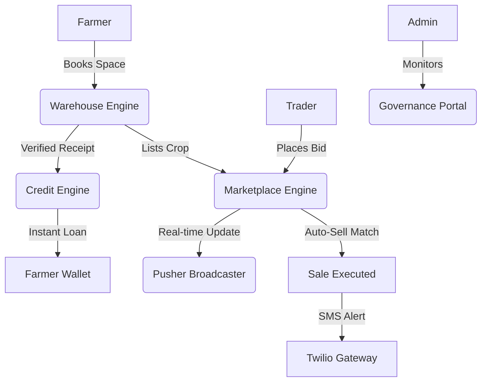

# AgriHold AI: Technical Architecture & System Overview

AgriHold AI is a high-performance, decentralized warehouse management and fintech platform designed to provide farmers with liquidity and market access. This document outlines the core architecture and engineering decisions behind the platform.

---

## 🏗️ 1. Core Technology Stack
- **Frontend**: Next.js 16 (App Router) with TypeScript.
- **Styling**: Vanilla CSS with Tailwind utility layers and the **Antigravity UI** design system.
- **Backend**: Next.js Server Actions and Route Handlers (Serverless optimized).
- **Database**: MongoDB Atlas with Mongoose (Strict schema modeling & ACID transactions).
- **Real-time Engine**: Pusher (WebSocket-based event broadcasting).
- **Notifications**: Twilio SMS API.
- **Mapping**: LeafletJS (SSR-safe, zero-cost mapping).

---

## 🛰️ 2. System Modules

### A. The Booking & Storage Engine
Manages the physical reservation of warehouse space.
- **Inventory Locking**: Uses MongoDB sessions to ensure that two farmers cannot book the last available ton of space simultaneously (ACID Transactions).
- **Digital Receipts**: Generates secure, Base64-encoded QR codes via `qrcode` containing signed booking metadata for warehouse verification.

### B. The Smart Credit Engine
Calculates and disburses crop-backed microloans.
- **LTV Algorithm**: Implements a 70% Loan-to-Value ratio against real-time crop market prices.
- **Automated Underwriting**: Evaluates verified storage receipts as collateral to provide instant, mock-payout credit.

### C. The Bidding & Marketplace Engine
A high-frequency trading floor for stored crops.
- **Live Bidding**: Uses Pusher to broadcast every new bid instantly to all connected users.
- **Smart Auto-Sell**: An automated execution layer that monitors incoming bids and instantly accepts those that meet the farmer's target price.
- **Atomic Bidding**: Validates that every bid is strictly higher than the current highest in a transaction-safe manner.

---

## 🛡️ 3. Security & Governance

### Role-Based Access Control (RBAC)
The system enforces strict data isolation based on user roles:
- **Farmer**: Manage storage, apply for loans, and list crops.
- **Trader**: Browse marketplace and place competitive bids.
- **Warehouse Owner**: Track facility utilization and verify drop-offs.
- **Admin**: Platform-wide governance and transaction monitoring.

### Data Integrity
- **ACID Transactions**: Used in all critical paths (Bookings, Auto-Sell, Bidding) to prevent race conditions.
- **Zod Validation**: Strict schema validation for all incoming API requests.

---

## 📡 4. Real-time & Communication Layer

### WebSocket Integration (Pusher)
- `marketplace-[id]`: Listing-specific channel for real-time bid updates and history.
- `marketplace-global`: Platform-wide channel for updating bid counts and market volume.

### SMS Gateway (Twilio)
- **Proactive Alerts**: Triggers SMS for high-stakes events (Trade Success, Outbid, Loan Payout).
- **Mock Fallback**: Developer-friendly logging system when live API keys are not present.

---

## 📊 5. Data Flow Diagram (Conceptual)

---

## 🛠️ 6. API Routing & Endpoint Registry

The platform uses a modular API structure organized by domain. All routes are protected by role-based middleware.

### 📦 Warehouse & Bookings
- `POST /api/bookings`: Reserves storage space with ACID transaction locking.
- `GET /api/bookings`: Retrieves a farmer's verified storage history.
- `GET /api/warehouse/stats`: (Owner only) Aggregates revenue and utilization analytics.

### 💰 Fintech & Microloans
- `POST /api/loan/check`: Internal Credit Engine for instant eligibility calculation.
- `POST /api/loans`: Disburses crop-backed credit and records transaction ledger.

### 📈 Marketplace & Bidding
- `GET /api/marketplace`: Dynamic listing discovery with location-based filtering.
- `POST /api/marketplace/bid`: High-frequency bidding engine with **Smart Auto-Sell** execution.
- `GET /api/marketplace/bid`: Real-time audit trail of bidding history for a specific listing.
- `PATCH /api/marketplace/auto-sell`: (Farmer only) Updates automated selling thresholds.

### 🏛️ Platform Governance (Admin Only)
- `GET /api/admin/stats`: Global KPI aggregator (Total Tonnage, Total Exposure).
- `GET /api/admin/transactions`: Multi-stream system audit log.

---

## 💻 7. User Dashboard Workflows

### 👨‍🌾 The Farmer Journey
1. **Discover**: Browse the interactive map to find nearby warehouses.
2. **Store**: Reserve space and receive a secure **Digital Receipt (QR)**.
3. **Liquidate**: Use the storage receipt as collateral for an **Instant Microloan**.
4. **Trade**: List stored crops on the Marketplace and set a **Smart Auto-Sell** target.

### 🤝 The Trader Journey
1. **Monitor**: View live-updating crop listings in the Marketplace.
2. **Compete**: Place bids in real-time and track the "Highest Bid" via Pusher.
3. **Execute**: Secure inventory instantly through direct manual or auto-accepted bids.

### 🏗️ The Warehouse Owner Journey
1. **Analyze**: Monitor facility utilization via real-time charts and utilization bars.
2. **Verify**: Use the QR scanner to validate incoming farmer stock against digital receipts.
3. **Optimize**: Track revenue trends and manage storage capacity dynamically.

---

## 🚀 8. Scalability & Deployment
- **Deployment**: Optimized for Vercel (Serverless).
- **Performance**: SSR-safe mapping and dynamic imports for Leaflet ensure fast initial page loads and zero hydration errors.
- **Reliability**: Centralized notification and error-handling services ensure that failures in third-party APIs (Twilio/Pusher) do not crash the core application.
